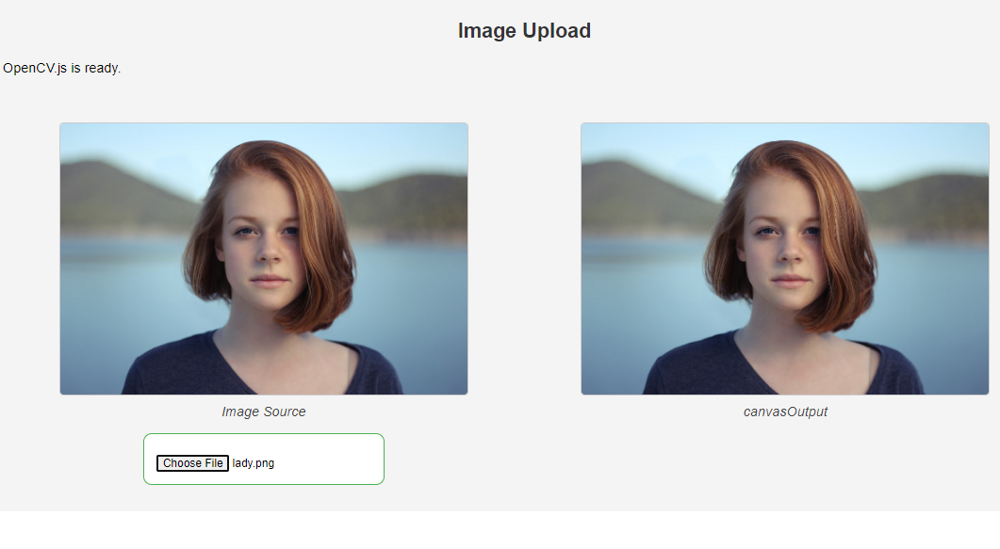

# Upload Image

## Description

The **Upload Image** project allows users to select an image file from their system and display it on a canvas using OpenCV JS routines. This application serves as an introduction to using OpenCV with JavaScript, facilitating image manipulation and visualization directly in the browser.

## Features

- **Image Upload**: Users can browse their files and choose an image.
- **Canvas Display**: The selected image is displayed on a canvas using the OpenCV JS library.
- **Visual Example**: An example of the resulting image is provided for reference.

## How to Use

1. Clone the repository:
   ```bash
   git clone https://github.com/your-username/OpenCV-JS.git
   ```

## Result

<div style="text-align: center;">  </div>
